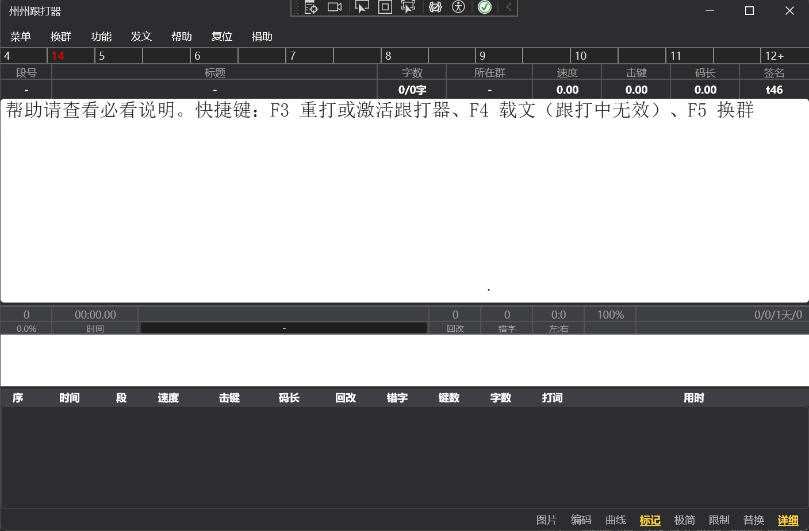

# 州州跟打器（zhouzhou-typing）

> **现代化的 WPF 跟打练习器 / 中文打字训练 / 五笔拼音跟打**：基于 [taliove/tygdq](https://github.com/taliove/tygdq) v0.94 重写，去掉所有 QQ / 比赛 / 检查更新相关功能，专注**纯本地跟打体验**。
>
> Modern WPF Chinese typing tutor (Wubi/Pinyin), portable, dark theme, real-time stats. Rewrite of the classic 添雨跟打器 (tygdq).

**关键词** / Keywords：跟打器、中文打字练习、五笔练习、拼音练习、打字训练、typing tutor for Chinese, Wubi/Pinyin typing trainer, WPF typing software, tygdq successor


[](https://github.com/lwl4613615/zhouzhou-typing/releases/latest)
[](https://github.com/lwl4613615/zhouzhou-typing)

---

## ✨ 特性

- **WPF 现代主题**（HandyControl 3.5.1）—— 暗/亮主题切换、阴影圆角、高 DPI 自适应
- **跟打核心**
  - 实时染色：对照区按字符比对，绿色对 / 红色错
  - 实时统计：速度（字/分）+ 错一罚五速度、击键（键/秒）、码长、回改、错字、左右手击键比
  - **重打次数 / 发呆秒数 / 键准百分比** 实时显示
  - 段内输入事件明细收集 → 跟打报告
  - **回改地点 0.8s 黄色高亮**（对齐老版 Show_Hg_Place）
  - 末字错允许回改不强制结束 / F3/F5/换文前强制结算
- **编码提示**（基于 `bm.txt`）
  - 76145 行词典反向索引，最长匹配优先词组
  - 状态条显示 [重数色块 + 字 + 编码]
  - **测试自定义 bm.txt** 工具
- **词组下划线**（自动智能测词）
  - 蓝=2字 / 紫=3字 / 红=4字+
  - 全码实线 / 非全码虚线
- **可视化窗**
  - 速度面积曲线（OxyPlot 实时）
  - 跟打地图（嵌入式 Canvas，进度斜率可视化）
  - 跟打报告（分段事件 DataGrid + 回改/卡顿染色 + 成绩图 PNG 导出）
  - 速度分析（4 项时间分解：正常打字 / 卡顿 / 回改 / 错字罚时）
  - 击键评定（9 级柱图 + jjC 评定值，对齐老版）
  - 平均成绩（基于全部历史 SQLite 聚合）
- **发文**
  - 自带文章 / 自定义 / 剪贴板三个文段源
  - 顺序 / 乱序 / 一句结束 / 全文一次发出
  - 段号点击弹列表跳段
  - 发文参数预设（命名保存/应用）
- **持久化**（便携模式）
  - 配置：JSON 原子写入 + .bak 自动备份回滚
  - 历史：SQLite + WAL 模式 + Busy Timeout
  - 文件都在 exe 同目录，**整个文件夹拷哪都跟着走**
- **系统集成**
  - 单实例 Mutex（防双开污染数据）
  - 托盘图标 + 最小化到托盘 + 右键菜单
  - 全局键盘钩子：F3/F4/F6/F8 不依赖窗口焦点
  - app.manifest：asInvoker + PerMonitorV2 高 DPI + UTF-8 代码页
  - 全局异常处理 + `newgdq.log` 日志
- **IME 兼容**：搜狗 / QQ 拼音 / 微软拼音的"空格/字母占位"陷阱已修复
- **性能优化**：差异染色（大文段 CPU -60%）、地图限点、SpeedChart 批量刷新

---

## 🖼️ 截图



---

## 🚀 快速开始

### 用户

1. 到 [Releases](https://github.com/lwl4613615/zhouzhou-typing/releases) 下载最新 zip
2. 解压到任意目录
3. 双击 `newgdq.exe`
4. **菜单 → 功能 → 内部测速** 选一篇文章开始练习

### 开发者

```powershell
git clone https://github.com/lwl4613615/zhouzhou-typing.git
cd zhouzhou-typing
# 用 Visual Studio 2022+ 打开 newgdq/newgdq.csproj，按 F5
```

需要环境：
- Windows 10/11
- .NET Framework 4.8 SDK
- Visual Studio 2022 或 MSBuild 18.x

第一次构建会自动从 NuGet 还原 HandyControl / OxyPlot。

---

## 🎮 主要操作

| 操作 | 说明 |
|---|---|
| **F2** | 打开发文设置 |
| **F3** | 重打当前文章（全局热键） |
| **F4** | 从剪贴板载文 |
| **F6** | 发下一段（发文中） |
| **F8** | 暂停 / 继续 |
| 菜单 → 外观... | 字体 / 颜色 / 个签 / 主题 / 托盘 / 自动重打 |
| 菜单 → 功能 → 内部测速 | 加载内置文章 8 篇 |
| 菜单 → 功能 → 跟打报告/速度分析/击键评定/平均成绩 | 数据分析窗口 |
| 菜单 → 功能 → 测试自定义 bm.txt | 验证用户自定义词典 |
| 底部"编码/曲线/地图/标记/极简/限制/替换/图片/详细" | 8 个开关 |
| 对照/输入/历史区之间分割条 | 鼠标拖动调整高度 |

---

## 🏗️ 项目结构

```
newgdq/
├── App.xaml(.cs)             — 应用入口 + HandyControl 主题
├── MainWindow.xaml(.cs)      — 主窗口 UI + 跟打主循环
├── Models/
│   ├── TypingSession.cs      — 单段跟打状态（替代原版 Glob 全局）
│   ├── HistoryRow.cs         — 历史成绩行
│   ├── TypeDate.cs           — 段内输入事件明细
│   ├── BmEntry.cs            — 字典条目
│   └── WordHit.cs            — 分词命中
├── Services/
│   ├── KeyHook.cs            — WH_KEYBOARD_LL 全局钩子
│   ├── ImeWatcher.cs         — IME 合成事件监听
│   ├── DictionaryService.cs  — bm.txt 字典 + 最长匹配
│   └── ArticleLoader.cs      — 嵌入式文章资源加载
├── Views/
│   ├── BmTipsWindow.xaml     — （已弃用，编码提示移到状态条）
│   └── SpeedChartWindow.xaml — 速度面积曲线浮窗
└── Resources/
    ├── bm.txt                — 词典（UTF-8，从上游 GBK 转码）
    └── TXT/                  — 内置文章 8 篇
```

---

## 🆚 与上游 [tygdq](https://github.com/taliove/tygdq) 的差异

| 类别 | 上游 (WinForms v0.94) | 州州跟打器 (WPF) |
|---|---|---|
| UI 框架 | WinForms 自绘 + QQ 风格 | WPF + HandyControl 深色主题 |
| **QQ 群发文 / 群名解析** | 有 | **删** |
| **比赛模式 / 精五成绩生成 / 测速点** | 有 | **删** |
| **检查更新** | 有 | **删** |
| **Access 数据库** | PerTyping.mdb + DataSet | 计划换 SQLite (P5) |
| 配置存储 | INI (`Ttyping.ty`) | 计划换 JSON (P4) |
| 词典查询 | `List<List<string>>` 全表线性扫描 | `Dictionary<char, List<BmEntry>>` 反向索引 + 最长匹配 |
| 词组下划线渲染 | 动态浮动 Label 控件 | `Run.TextDecorations`（性能更好） |
| 全局状态 | `static Glob`（252 行字段） | `TypingSession` 实例化 |
| 跟打核心代码 | `FormType.cs` 5476 行 | `MainWindow.xaml.cs` ~600 行 + 拆分 services |
| **跟打、染色、统计、编码提示等核心功能** | ✓ | ✓ |

---

## 📋 路线图

- [x] **P1** WPF 骨架 + 主窗口 + 跟打核心
- [x] **P2** 键钩子 + IME + 实时统计 + 编码提示 + 词组下划线 + 速度曲线
- [x] **P3** 发文窗口 + 设置窗口 + 主题切换（暗/亮）
- [x] **P4** 配置 JSON 持久化 + SettingsWindow + SQLite 历史
- [x] **P5** 跟打报告 + 速度分析 + 击键评定 + 平均成绩 + 成绩图导出
- [x] **P6** 托盘 + 单实例 Mutex + 全局异常处理 + manifest + app icon
- [x] **P7** 性能优化（差异染色 / 地图限点 / SQLite WAL）+ 边界 bug 修复
- [x] **P8** ytgdq 借鉴：重打次数 / 发呆显示 / 键准 / 高度可拖

**核心迁移已完成** ✅ 详细完成情况见 [迁移方案.md](迁移方案.md) 与 [ROADMAP.md](ROADMAP.md)。

---

## 💬 交流群

- **QQ 群**：`17079867`
- **加群链接**：https://qm.qq.com/q/eb2iF433q2 （问题反馈优先用这个）

---

## ☕ 支持作者

如果觉得有用，欢迎请喝杯咖啡：


---

## 🤝 贡献

欢迎 PR / Issues。开发约定见 [AGENTS.md](AGENTS.md)（基于 Andrej Karpathy 的 LLM 编码准则）。

---

## 📄 协议

本项目采用 [Apache License 2.0](LICENSE)，与上游 [taliove/tygdq](https://github.com/taliove/tygdq) 保持一致。

复用的上游代码版权归原作者 **taliove** 所有，详见 [NOTICE](NOTICE)。

WPF 重写部分 © 2026 4613615@qq.com，遵循 Apache-2.0。

---

## 🙏 致谢

- [taliove/tygdq](https://github.com/taliove/tygdq) — 原版添雨跟打器，本项目所有跟打核心算法、bm.txt 词典、内置文章均源自上游
- [HandyOrg/HandyControl](https://github.com/HandyOrg/HandyControl) — WPF 控件库
- [oxyplot/oxyplot](https://github.com/oxyplot/oxyplot) — 图表库
